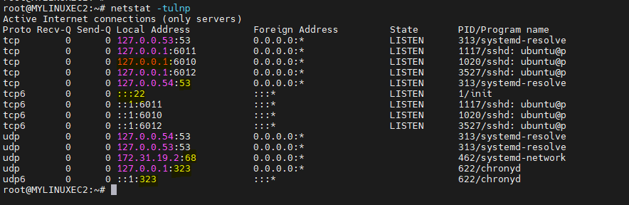
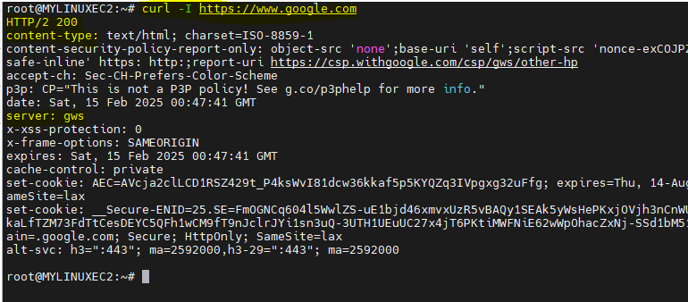

# Linux Drills : Networking Protocols, Ports, and Commands

## Part A: Practical Questions


### 1. Checking Connectivity with ping
    
    ```bash
    root@ip-#-#-#-#:~# ping -c 5 google.com | grep "time=" | awk -F'=' '{print $4}' | awk '{print $1}'
    1.18
    1.17
    0.944
    1.25
    1.64
    ```
> What is the average round-trip time (RTT) reported by the command?

* To calculate RTT, grep for time and print its value in sec.
* Calculate AVG time by using 'bc' with scale=2 to return decimal value avg.
  
      average_rtt=$(echo "scale=2; $total_rtt / $count" | bc)


>Did you observe any packet loss?

No Packet loss observed.

### 2. Tracing the Route with traceroute/tracert

``` bash
root@ip-#-#-#-2:~# tracepath github.com
 1?: [LOCALHOST]                      pmtu 9001
 1:  ip-#-31-#-1.eu-west-1.compute.internal             0.085ms pmtu 1500
 1:  no reply
 2:  #.1.100.4                                           0.687ms
 3:  240.4.244.15                                          2.072ms asymm  5
 4:  #.82.178.62                                          1.088ms asymm  7
 5:  #.82.178.63                                          1.080ms asymm  7
 6:  ae27-0.icr01.dub08.ntwk.msn.net                       1.819ms asymm  7
.....
28:  no reply
29:  no reply
30:  no reply
     Too many hops: pmtu 1500
     Resume: pmtu 1500
```

* Observations from above command:
  *  command exited after 30 hops. We were unable to trace the destination. Tracepath will exit when dest is reached if not it will continue till 30 Hops and drops
  *  The time we see is the time taken for the packet to reach that hop and return

### 3. Monitoring Open Ports with netstat



* identifyng the ports listening from above snaps
  * SSHD with port 22
  * local DNS service under port 53
  * Chronyd for time sync under port 323 (UDP)
  * bunch of loopback IP and ports belonging to backend SSHd child processes

### 4. Fetching Http Headers with Curl



* What are the key HTTP response headers you observe?
  * Http response code, Content-Tpe, Server, Last modified 
* What do these headers indicate about the website’s server or security configuration?
  * The first line of the response indicates the HTTP version, status code, and status message.
    * 200 OK: The request was successful
  * Next: Content-Type: text/html; charset=UTF-8
    *  Specifies the media type (MIME type) 
   *  Last-Modified
      * The date and time when the resource was last modified. Used for caching and conditional requests.
